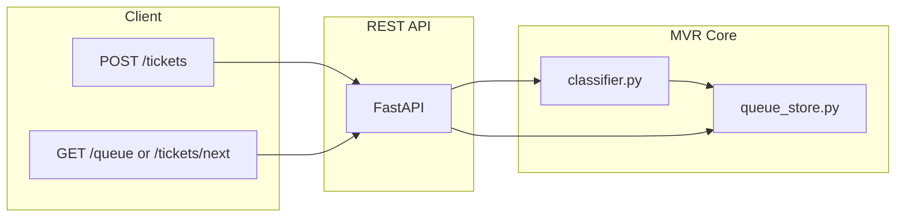

# MVR — Minimum Viable Router (Milestone 1)

Ticket routing API: classify tickets (Billing / Technical / Legal), score urgency via regex, and store in an in-memory priority queue.

---

## Architecture

The system is single-threaded. A request comes in as JSON; the API classifies it, scores urgency, and pushes it onto an in-memory priority queue. Agents (or other services) pull the next ticket by priority.



**Request flow (POST /tickets):**

1. Client sends JSON with `subject`, `body`, and/or `description`.
2. **app.py** validates the payload (via **models.py**) and concatenates the text.
3. **classifier.py** assigns a category (Billing, Technical, Legal) and an urgency score (0 or 1) using keyword/regex rules.
4. **queue_store.py** pushes the ticket onto a heapq with priority `(-urgency, timestamp, id)` so higher urgency and earlier time come first.
5. The API returns `ticket_id`, `category`, `urgency`, and `"queued"`.

**Request flow (GET /tickets/next):**

1. **queue_store.py** pops the highest-priority ticket from the heap.
2. The API returns that ticket (or 404 if the queue is empty).

---

## What each file does

| File | Purpose |
|------|--------|
| **app.py** | FastAPI application and routes. Defines `POST /tickets` (submit and enqueue), `GET /queue` (list queue), `GET /tickets/next` (dequeue one), and `GET /health`. Orchestrates the classifier and queue; does not contain business logic. |
| **classifier.py** | ML-style baseline: **category** (keyword rules for Billing, Technical, Legal; tie-break order Legal > Billing > Technical; default Technical) and **urgency** (regex for ASAP, urgent, broken, down, outage, etc. → high=1, low=0). Pure functions: `classify_category(text)`, `get_urgency(text)`, `get_urgency_label(text)`. |
| **queue_store.py** | In-memory priority queue using Python’s **heapq**. Stores entries as `(priority_key, payload)` with `priority_key = (-urgency_score, timestamp, ticket_id)` so the heap yields highest urgency and oldest first. Exposes `add_ticket()`, `get_next()`, `peek_queue()`, `queue_size()`. No persistence; process memory only. |
| **models.py** | Pydantic request/response models: **TicketCreate** (incoming JSON; at least one of subject/body/description required), **TicketQueuedResponse** (after submit), **TicketItem** (one ticket from queue). Ensures validation and consistent API shapes. |
| **requirements.txt** | Python dependencies: FastAPI, Uvicorn, Pydantic. |

---

## Setup

```bash
pip install -r requirements.txt
```

## Run

```bash
uvicorn app:app --reload
```

API: http://127.0.0.1:8000  
Docs: http://127.0.0.1:8000/docs

## Endpoints

- **POST /tickets** — Submit a ticket (JSON: `subject`, `body`, and/or `description`). Returns `ticket_id`, `category`, `urgency`, `message: "queued"`.
- **GET /queue** — List queued tickets in priority order (no dequeue).
- **GET /tickets/next** — Dequeue and return the next ticket (404 if empty).
- **GET /health** — Health check.

## How to run and test

**1. Install and start the server**

```bash
cd "/Users/shreyashridevarajan/Documents/Batch Hackathon"
pip install -r requirements.txt
uvicorn app:app --reload
```

Leave this terminal open. The API will be at **http://127.0.0.1:8000**.

**2. Open the interactive docs (optional)**  
In a browser: **http://127.0.0.1:8000/docs** — you can try POST /tickets and GET /queue there.

**3. Test with curl** (in a second terminal)

```bash
# Health check
curl http://127.0.0.1:8000/health

# Submit a high-urgency technical ticket
curl -X POST http://127.0.0.1:8000/tickets \
  -H "Content-Type: application/json" \
  -d '{"subject":"Login broken ASAP","body":"Users cannot log in."}'

# Submit a low-urgency billing ticket
curl -X POST http://127.0.0.1:8000/tickets \
  -H "Content-Type: application/json" \
  -d '{"subject":"Invoice question","body":"When will I get my refund?"}'

# See the queue (high-urgency first)
curl http://127.0.0.1:8000/queue

# Take the next ticket (dequeues it)
curl http://127.0.0.1:8000/tickets/next
```

**4. What to expect**

- POST /tickets returns `ticket_id`, `category` (Billing | Technical | Legal), `urgency` (low | high), and `"queued"`.
- GET /queue returns all queued tickets in priority order.
- GET /tickets/next returns one ticket and removes it from the queue; 404 if the queue is empty.

---

## Example (single request)

```bash
curl -X POST http://127.0.0.1:8000/tickets \
  -H "Content-Type: application/json" \
  -d '{"subject":"Login broken ASAP","body":"Users cannot log in."}'
```
