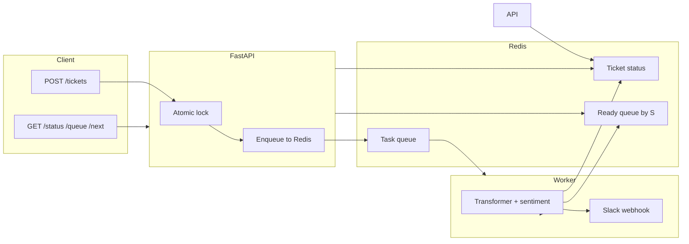

# MVR — Minimum Viable Router

A ticket routing API that classifies support tickets (Billing, Technical, Legal), scores urgency with ML, queues them in **Redis**, and sends high-urgency alerts (S > 0.8) to **Slack**.

---

## Table of contents

1. [Architecture](#architecture)
2. [What each file does](#what-each-file-does)
3. [Slack setup](#slack-setup)
4. [How to run (Mac and Windows)](#how-to-run-mac-and-windows)
5. [How to test](#how-to-test)
6. [API endpoints](#api-endpoints)

---

## Architecture

The system has three main parts: the **API** (FastAPI), **Redis** (queue and state), and a **worker** process that runs ML and posts to Slack.

### High-level flow



### Step-by-step data flow

**1. Client submits a ticket (POST /tickets)**

- The client sends JSON with `subject`, `body`, and/or `description`.
- The API validates the payload (Pydantic). It then acquires a **Redis lock** (to avoid duplicate IDs under concurrency), generates a unique `ticket_id`, and writes an initial **status** entry in Redis with `status: "pending"`.
- The API pushes a **message** (ticket_id, subject, body, description, combined_text, created_at) onto the **Redis list** used as the task queue.
- The API returns **202 Accepted** immediately with `ticket_id` and `status_url`. No ML runs in the API.

**2. Worker processes the ticket**

- The worker blocks on **Redis BLPOP** (blocking pop) on the task queue.
- When a message appears, the worker acquires a **per-ticket processing lock** in Redis so the same ticket is never processed twice.
- The worker sets status to **"processing"** in Redis.
- It runs **ML**: a Transformer-based zero-shot classifier for **category** (Billing, Technical, Legal) and a sentiment model for **urgency score S** in [0, 1]. If ML fails, it falls back to the baseline keyword/regex logic in `classifier.py`.
- The worker writes the result to Redis: `status: "completed"`, `category`, `urgency_score`, `urgency_label`, and adds the ticket to a **Redis sorted set** (ready queue) keyed by S so higher-urgency tickets are served first.
- If **S > 0.8**, the worker POSTs a message to the **Slack webhook** (if `SLACK_WEBHOOK_URL` is set).
- The worker releases the processing lock and loops back to BLPOP.

**3. Client checks status or gets the next ticket**

- **GET /tickets/{ticket_id}/status** reads the status hash for that ticket from Redis (pending → processing → completed, with category and urgency_score once completed).
- **GET /queue** returns all ticket IDs from a Redis set, fetches each status from Redis, and sorts them (e.g. completed by urgency, then pending/processing).
- **GET /tickets/next** pops the ticket with the highest S from the Redis sorted set, returns its data, and removes it from the set.

### Components summary

| Component | Role |
|-----------|------|
| **FastAPI (app.py)** | REST API: accept tickets (202), serve status/queue/next, health. Uses async Redis for lock and enqueue; reads from Redis for status and queue. |
| **Redis** | Task queue (list), ticket status (key-value), ready queue (sorted set by S), and atomic locks (submit + per-ticket processing). |
| **Worker (worker.py)** | Single process: BLPOP queue → ML (or baseline) → write status + ready queue → Slack if S > 0.8. |
| **Slack** | Optional: receive a formatted message when a ticket has urgency score S > 0.8. |

---

## What each file does

| File | Purpose |
|------|---------|
| **app.py** | FastAPI app and routes. **POST /tickets**: validates body, acquires Redis submit lock, generates ticket_id, writes pending status, enqueues to Redis, returns 202 with ticket_id and status_url. **GET /tickets/{ticket_id}/status**: returns status from Redis. **GET /queue**: lists all tickets from Redis, sorted. **GET /tickets/next**: pops highest-urgency completed ticket from Redis. **GET /health**: returns ok. No ML or Slack logic here. |
| **broker.py** | Redis access. Sync client for the worker (BLPOP, locks, status, ready set). Async client for the API (lock, enqueue, status, queue listing). Defines queue key, status key prefix, submit lock, processing lock, and helpers: enqueue, dequeue, set/get status, add to ready queue, pop next ready, list all ticket IDs. |
| **config.py** | Central config from environment: REDIS_URL, queue and key names, SLACK_WEBHOOK_URL, URGENCY_WEBHOOK_THRESHOLD (0.8). get_slack_webhook_url() returns the Slack URL (or empty string). |
| **worker.py** | Background worker process. Loads .env from project root, then in a loop: BLPOP the Redis queue, acquire processing lock per ticket, set status to processing, run ML (ml_models) or fallback (classifier), write completed status to Redis, add to ready queue, call webhook (Slack) if S > 0.8, release lock. Logs whether Slack webhook is configured on startup. |
| **ml_models.py** | ML inference (used only in worker). Lazy-loads a zero-shot classification pipeline (Billing/Technical/Legal) and a sentiment pipeline. predict_category(text) and predict_urgency_score(text) return category and S in [0, 1]. Falls back to classifier.py if imports or inference fail. |
| **classifier.py** | Baseline (keyword + regex) used when ML is not used or fails. classify_category(text), get_urgency(text), get_urgency_label(text). Used by worker as fallback and by test/legacy paths. |
| **webhook.py** | Slack notification. notify_high_urgency(ticket_id, S, category, text) builds a short message and, if S > 0.8 and SLACK_WEBHOOK_URL is set, POSTs it to Slack. Otherwise logs "Mock webhook would fire". |
| **models.py** | Pydantic models: TicketCreate (request body; at least one of subject/body/description), TicketAcceptedResponse (202 body), TicketStatusResponse (status endpoint), TicketItem (queue/next response). |
| **queue_store.py** | In-memory heapq queue (legacy/M1-style). Not used by the main M2 flow; M2 uses Redis in broker.py. |
| **requirements.txt** | Dependencies: fastapi, uvicorn, pydantic, redis, httpx, python-dotenv, transformers, torch, sentencepiece. |
| **.env.example** | Example environment file: REDIS_URL and optional SLACK_WEBHOOK_URL. Copy to .env and fill in. |
| **test_slack_webhook.py** | Script to test Slack only: loads .env, reads SLACK_WEBHOOK_URL, POSTs a test message. Run with `python test_slack_webhook.py`. |

---

## Slack setup

When a ticket’s urgency score **S > 0.8**, the worker can send a message to a Slack channel. This is optional.

### 1. Get the Slack webhook URL

1. Open [api.slack.com/apps](https://api.slack.com/apps) and sign in.
2. **Create New App** → **From scratch** → name (e.g. “Ticket Alerts”) and select your workspace → **Create App**.
3. In the app, open **Incoming Webhooks** and turn **Activate Incoming Webhooks** **On**.
4. Click **Add New Webhook to Workspace**, choose the channel (e.g. `#support`), then **Allow**.
5. Copy the **Webhook URL** (e.g. `https://hooks.slack.com/services/T.../B.../xxx`).

### 2. Configure the project

Create a `.env` file in the project root (same folder as `app.py` and `worker.py`). Copy from the example and set your URL:

**Mac / Linux (in project folder):**

```bash
cp .env.example .env
```

Then edit `.env` and add or uncomment:

```
SLACK_WEBHOOK_URL=https://hooks.slack.com/services/T.../B.../xxx
```

**Windows (in project folder):**

```powershell
copy .env.example .env
```

Then edit `.env` in a text editor and add the line above (no quotes, no spaces around `=`).

The worker loads `.env` automatically when it starts (via `python-dotenv`), so no need to export the variable manually if you use `.env`.

### 3. Verify Slack (optional)

Run the test script to send one message to Slack:

**Mac / Linux:**

```bash
./venv/bin/python test_slack_webhook.py
```

**Windows:**

```powershell
.\venv\Scripts\python.exe test_slack_webhook.py
```

If you see "OK: Message sent to Slack. Check your channel.", the URL is correct.

### 4. Restart the worker

After changing `.env`, restart the worker. On startup it will log either "Slack webhook: configured" or "Slack webhook: not set". When a ticket is processed with S > 0.8, the worker will POST to Slack (or log the mock message if the URL is not set).

---

## How to run (Mac and Windows)

You need **three** processes: Redis, the API, and the worker. Use three terminals (or two for API + worker if Redis runs as a service).

### Prerequisites

- **Python 3.9+** (3.10+ recommended).
- **Redis** (see below for Mac vs Windows).

### 1. Clone / open project and create venv

**Mac / Linux:**

```bash
cd "/path/to/Batch Hackathon"
python3 -m venv venv
./venv/bin/pip install -r requirements.txt
```

**Windows (Command Prompt or PowerShell):**

```powershell
cd "C:\path\to\Batch Hackathon"
python -m venv venv
.\venv\Scripts\pip install -r requirements.txt
```

### 2. Start Redis

**Mac (Homebrew):**

```bash
brew install redis
brew services start redis
redis-cli ping
```

You should see `PONG`. To run Redis in the foreground instead: `redis-server`.

**Windows:**

- Option A: Install Redis via [Windows port](https://github.com/microsoftarchive/redis/releases) or [WSL](https://docs.microsoft.com/en-us/windows/wsl/), then start the Redis server and ensure it listens on `localhost:6379`.
- Option B: Use a cloud Redis (e.g. Redis Cloud) and set `REDIS_URL` in `.env` to that URL.

Verify with `redis-cli ping` if available, or by starting the API and worker; they will fail to connect if Redis is not reachable.

### 3. (Optional) Configure .env

Copy `.env.example` to `.env` and set `REDIS_URL` if not using `localhost:6379`, and `SLACK_WEBHOOK_URL` for Slack alerts (see [Slack setup](#slack-setup)).

### 4. Start the API

**Mac / Linux (Terminal 1):**

```bash
cd "/path/to/Batch Hackathon"
./venv/bin/python -m uvicorn app:app --reload --port 8000
```

**Windows (Terminal 1):**

```powershell
cd "C:\path\to\Batch Hackathon"
.\venv\Scripts\python.exe -m uvicorn app:app --reload --port 8000
```

Leave this running. You should see something like: `Uvicorn running on http://127.0.0.1:8000`. There is no page at `/`; use `/docs` or `/health`.

### 5. Start the worker

**Mac / Linux (Terminal 2):**

```bash
cd "/path/to/Batch Hackathon"
./venv/bin/python worker.py
```

**Windows (Terminal 2):**

```powershell
cd "C:\path\to\Batch Hackathon"
.\venv\Scripts\python.exe worker.py
```

Leave this running. You should see "Worker started, listening on queue mvr:ticket_queue" and, if Slack is set, "Slack webhook: configured". The first run may download ML models.

---

## How to test

### Quick check (browser)

1. Open **http://127.0.0.1:8000/docs**.
2. Try **GET /health** → should return `{"status":"ok"}`.
3. Try **POST /tickets** with body: `{"subject":"Login broken ASAP","body":"Cannot log in."}` → should return **202** with `ticket_id` and `status_url`.
4. Copy `ticket_id` and call **GET /tickets/{ticket_id}/status** until `"status":"completed"` and you see `category` and `urgency_score`.
5. Try **GET /queue** and **GET /tickets/next**.

### Using curl (Mac / Linux)

```bash
# Health
curl -s http://127.0.0.1:8000/health

# Submit ticket
curl -s -X POST http://127.0.0.1:8000/tickets \
  -H "Content-Type: application/json" \
  -d '{"subject":"Login broken ASAP","body":"Cannot log in."}'

# Status (replace TICKET_ID with the id from the previous response)
curl -s http://127.0.0.1:8000/tickets/TICKET_ID/status

# Queue
curl -s http://127.0.0.1:8000/queue

# Next ticket
curl -s http://127.0.0.1:8000/tickets/next
```

### Using PowerShell (Windows)

```powershell
# Health
Invoke-RestMethod -Uri "http://127.0.0.1:8000/health" -Method Get

# Submit ticket
$body = '{"subject":"Login broken ASAP","body":"Cannot log in."}'
Invoke-RestMethod -Uri "http://127.0.0.1:8000/tickets" -Method Post -Body $body -ContentType "application/json"

# Status (replace TICKET_ID with the id returned above)
Invoke-RestMethod -Uri "http://127.0.0.1:8000/tickets/TICKET_ID/status" -Method Get

# Queue
Invoke-RestMethod -Uri "http://127.0.0.1:8000/queue" -Method Get

# Next ticket
Invoke-RestMethod -Uri "http://127.0.0.1:8000/tickets/next" -Method Get
```

### What to expect

- **POST /tickets** → **202** with `ticket_id`, `status: "accepted"`, `status_url`.
- **GET /tickets/{id}/status** → `pending` → `processing` → `completed`; when completed, `category`, `urgency_score` (S in [0, 1]), `urgency_label`.
- **GET /queue** → list of tickets (from Redis), ordered by urgency.
- **GET /tickets/next** → one completed ticket (highest S), or 404 if none.
- If S > 0.8 and Slack is configured, the worker posts to your Slack channel.

---

## API endpoints

| Method | Path | Description |
|--------|------|-------------|
| POST | /tickets | Submit a ticket. Body: JSON with `subject`, `body`, and/or `description`. Returns **202** with `ticket_id`, `status`, `status_url`. |
| GET | /tickets/{ticket_id}/status | Get status: `pending`, `processing`, or `completed`; when completed includes `category`, `urgency_score`, `urgency_label`. |
| GET | /queue | List all tickets (from Redis), sorted by urgency. |
| GET | /tickets/next | Dequeue and return the highest-urgency completed ticket; 404 if queue empty. |
| GET | /health | Health check; returns `{"status":"ok"}`. |

API docs (Swagger): **http://127.0.0.1:8000/docs**
